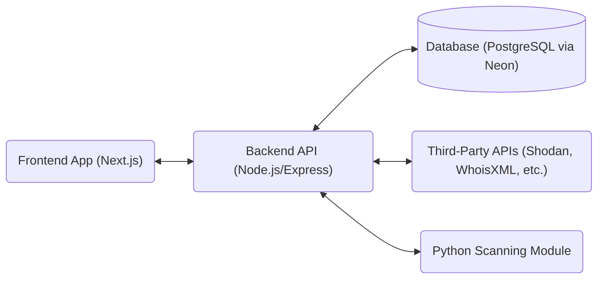

# Attack Surface Management (ASM) Project Overview & Architecture

## 1. What is this Project?
This project is an **Attack Surface Management (ASM) / External Attack Surface Management (EASM) platform**. It provides a comprehensive, web-based dashboard designed to help security operations teams continuously monitor, discover, and analyze exposed digital assets and vulnerabilities that make up an organization's continuous external attack surface. 

**Key Features Include:**
- **Dashboard Overview:** Visibility into overall security grades, asset inventories, risk levels, and vulnerability scores.
- **Discovery (Digital Footprint):** Searching for domains, subdomains, handling WHOIS information, and discovering active services (integrated with third-party tools like Shodan).
- **Vulnerability & Issues Tracking:** Reporting identified security weaknesses.

## 2. General Architecture Architecture Design
The project is structured as a **monorepo** employing a decoupled Client-Server architecture. The codebase is neatly separated into two main applications placed under the `apps/` directory:

1. **Frontend Client (`apps/web-console`):** A modern React application that consumes internal backend REST APIs to display interactive dashboards and data tables.
2. **Backend API (`apps/console`):** A Node.js Express server that handles business logic, proxies third-party APIs (for threat intel like Shodan or WhoIsXML), manages database queries, and handles authentication.

### High-Level Data Flow:


---

## 3. Technology Stack

### Frontend `apps/web-console`
- **Framework:** Next.js 14/15 (App Router paradigm) with React 19.
- **Styling:** Tailwind CSS v4, utilizing shadcn/ui components built on Radix UI, focused on a sleek "cyberpunk / dark-blue" aesthetic.
- **Data Visualization:** Recharts (for analytics and dashboards) and React-Simple-Maps (for geographic data plotting).
- **Language:** TypeScript

### Backend `apps/console`
- **Framework:** Node.js with Express.js (v5.x).
- **Database ORM:** Prisma ORM. Currently configured to use **PostgreSQL (via Neon)**.
- **Scanning Engine:** Custom **Python scripts** for modular vulnerability assessments (SSL, HTTP, FTP, etc.).
- **Authentication:** Custom JWT-based authentication relying on `jsonwebtoken` and `bcryptjs` with HTTP-only cookies managed via `cookie-parser`.
- **Language:** TypeScript & Python

---

## 4. Detailed Project Structure

### Root Directory
```text
/prompt_ASM_00
├── apps/               # The monorepo workspace containing major projects
│   ├── console/        # BACKEND PROJECT
│   └── web-console/    # FRONTEND PROJECT
├── README.md           # Instructions on how to run the frontend
```

### Backend: `apps/console`
The REST API that powers the ASM software.
```text
apps/console/
├── .env                # Environment variables (DB URLs, API Keys like Shodan API token)
├── prisma/             # Prisma ORM schema and seed scripts
│   ├── schema.prisma   # Defines the DB models (Users, Assets, Issues)
│   └── seed.ts         # Initial DB seeding for development
├── src/                
│   ├── index.ts        # Main Express application entry point & Middleware setup
│   ├── lib/            # Shared utilities (e.g., shodan.ts for API proxies)
│   ├── middlewares/    # Custom Express middlewares (e.g., auth checks)
│   └── routes/         # Express route handlers
├── python_modules/     # NEW: Vulnerability Scanning Scripts
│   ├── openssl_vuln.py # SSL/TLS vulnerability checks
│   ├── redirect_http.py# HTTP to HTTPS redirect validation
│   ├── ftp_anon.py     # Anonymous FTP access detection
│   └── ...             # Other modular scanner scripts
└── prisma/             # Database schema (PostgreSQL provider)
```

### Frontend: `apps/web-console`
The web dashboard application mapping the data provided by the backend.
```text
apps/web-console/
├── src/
│   ├── app/            # Next.js App Router (File-system based routing mechanism)
│   │   ├── (auth)/     # Public routes handling User Login/Signup
│   │   └── (protected)/# Auth-required routes (Dashboard, Assets, Settings)
│   ├── components/     # Reusable React components (shadcn ui, bespoke cards, charts)
│   ├── lib/            # Frontend utilities (utils.ts)
│   ├── providers/      # React context providers (Themes, AuthStates)
│   └── types/          # TypeScript definitions
├── public/             # Static Assets (Logos, SVGs)
├── tailwind.config.ts  # Theme settings defining brand colors and layout utilities
└── ...
```

## 5. Summary
This project acts as a security operations nerve center, proxying requests securely through its Node.js backend using tools like the **Shodan API** while masking API keys. It now features a powerful **PostgreSQL-backed** data model hosted on **Neon** and an extensible **Python scanning engine** that performs active vulnerability assessments across various protocols. Its UI leverages modern **Next.js features** with performant, utility-first components representing real-world asset risks and issues.
